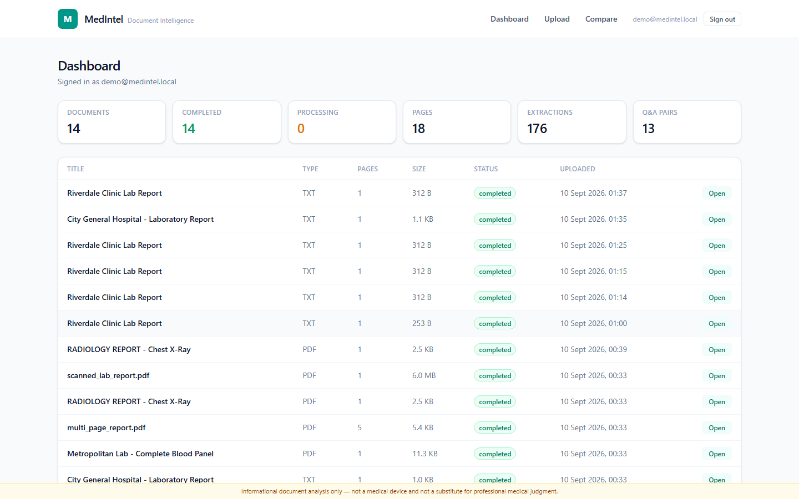
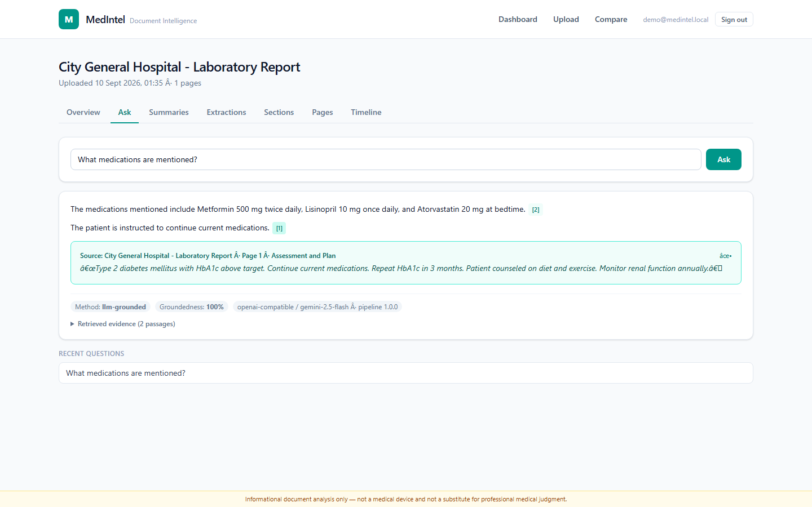
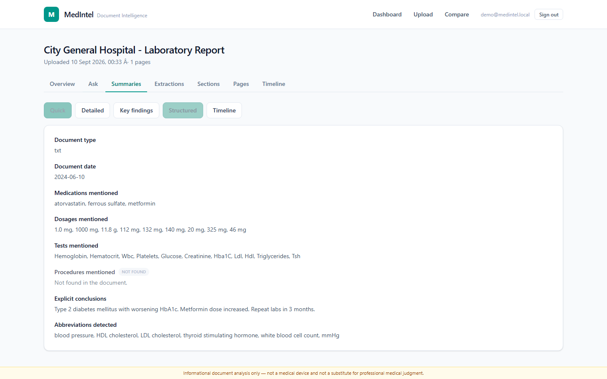
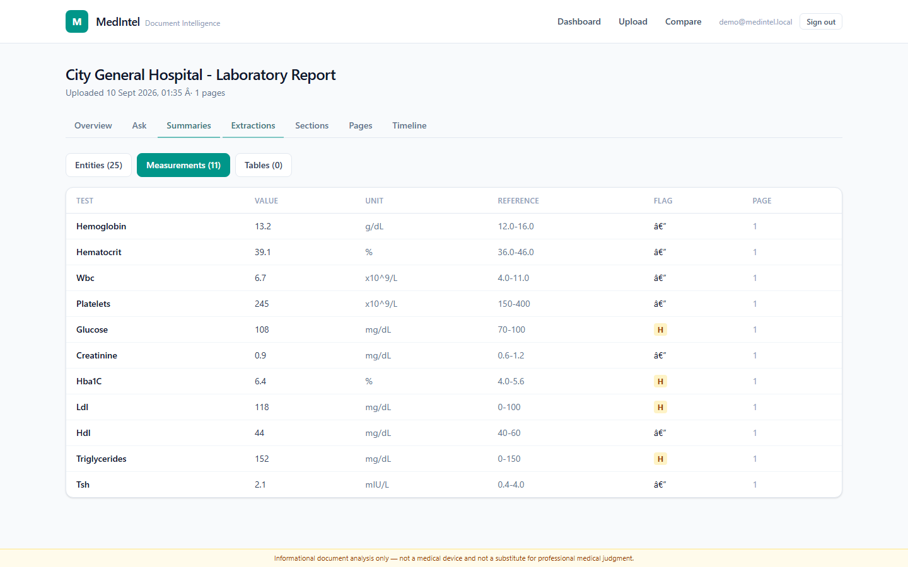
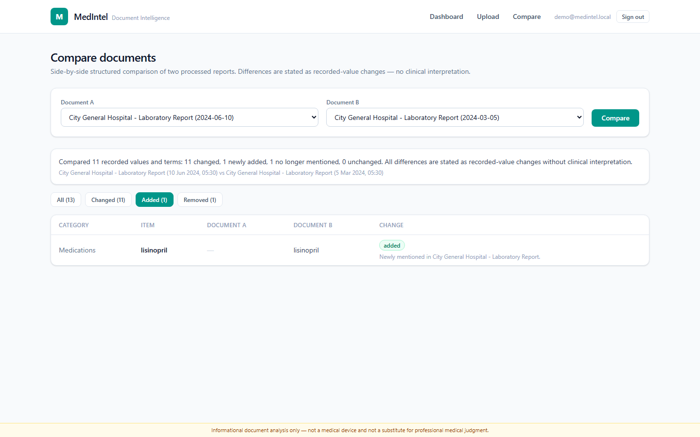

# MedIntel — AI Medical Document Intelligence Platform

<!-- CI badge — uncomment after pushing and fill in your GitHub username:
[](https://github.com/YOUR_USERNAME/medical-document-intelligence/actions/workflows/ci.yml)
-->

A production-style document-intelligence system for medical reports: ingestion,
OCR, structure-aware extraction, hybrid retrieval RAG with **verifiable
citations**, multi-mode summarization, deterministic document comparison,
timeline construction, and contradiction detection — with full source
provenance on every generated claim.

> **Medical safety**: MedIntel is an *informational document-analysis tool*.
> It does not provide medical advice, diagnosis, or treatment recommendations,
> and it is not a medical device. It reports **what documents explicitly say**
> — interpretation of medical information requires qualified professionals.

## Screenshots

| Landing | Dashboard |
|---|---|
|  |  |

| Ask — grounded answer + citation popover | Structured summary (with honest "not found") |
|---|---|
|  |  |

| Extracted measurements + flags | Document comparison |
|---|---|
|  |  |

*(All screenshots captured by the automated Playwright user-journey test from synthetic fixture documents.)*

---

## Why this exists

Typical "chat with PDF" prototypes share three flaws that this project was
designed to eliminate from the ground up:

1. **No provenance** — answers have no verifiable link to the exact page and
   passage they came from.
2. **No refusal** — when evidence is missing, the model is incentivized to
   hallucinate anyway.
3. **No structure** — a medical report's tables, lab values, and sections are
   flattened into an undifferentiated text blob.

MedIntel fixes all three structurally:

| Flaw | MedIntel's answer |
|---|---|
| No provenance | Every answer sentence carries citation refs (`[1]`, `[2]`…) that resolve to **stored chunk + page + quote** in the database. Fake citations are structurally impossible — citations reference foreign keys, not strings. |
| No refusal | The evidence validator refuses to answer when retrieval support is insufficient, and the extractive engine only composes answers **from source sentences**. |
| No structure | Dedicated detectors for sections, tables (rows preserved), lab measurements (value/unit/range/flag), medications, dosages, dates — each with page-level provenance. |

---

## Architecture

```
┌──────────────┐     ┌────────────────────────────────────────────┐
│  Next.js 15  │────▶│  FastAPI backend (uvicorn)                 │
│  React 19    │     │  ├─ auth (JWT, bcrypt, rate limits)        │
│  Tailwind 4  │     │  ├─ documents API                         │
└──────────────┘     │  ├─ qa / summaries / compare API           │
                     │  └─ worker pool (ThreadPoolExecutor)       │
                     │        └─ processing pipeline               │
                     │            1. validate + hash + store      │
                     │            2. extract text (PDF/DOCX/TXT)   │
                     │            3. OCR scanned pages (Tesseract)│
                     │            4. clean (header/footer removal) │
                     │            5. structure detection            │
                     │            6. entity + table extraction     │
                     │            7. chunking (structure-aware)    │
                     │            8. index build (TF-IDF + BM25)   │
                     └─────────────┬──────────────────────────────┘
                                   │
                     ┌─────────────▼──────────────┐
                     │  SQLAlchemy 2 + Alembic     │
                     │  SQLite (dev) / Postgres    │
                     │  (prod, pgvector ready)     │
                     └────────────────────────────┘
```

Full technical document: [docs/architecture.md](docs/architecture.md).

## The RAG pipeline

1. **Chunking** — structure-aware: chunks never cross page or section
   boundaries, so provenance stays exact. Tables become pipe-delimited chunks
   flagged `is_table_chunk` and are never split.
2. **Embedding** — provider abstraction:
   - `local` (default): TF-IDF per-document index — offline, deterministic,
     zero-cost. Honest limitation: no deep cross-document semantics.
   - `openai`: any OpenAI-compatible `/embeddings` endpoint (config-driven).
3. **Hybrid retrieval** — TF-IDF cosine **+** BM25 fused via Reciprocal Rank
   Fusion, plus a lexical coverage bonus and **abbreviation-aware query
   expansion** (`blood pressure` ↔ `BP`, `WBC` ↔ `white blood cell count`).
   BM25 nails exact drug/test names; TF-IDF handles paraphrase.
4. **Grounded generation** — two layers:
   - **Extractive engine (default)**: selects and ranks source sentences by
     query relevance + support, each carrying citation refs. Deterministic,
     testable, zero-cost, offline, ~100ms.
   - **Optional LLM rewriter**: when `LLM_PROVIDER` is configured, the LLM
     only rewrites *selected evidence sentences* into fluent prose under a
     strict contract; output sentences without valid citation markers or
     source overlap are **dropped by the validator**. Free-tier Gemini
     (`gemini-2.5-flash` via its OpenAI-compatible endpoint) or local Ollama
     both work — see `.env.example`. Answers take ~3–7s in LLM mode vs ~100ms
     extractive; refusals never reach the LLM, so grounding is never
     compromised by generation.
5. **Refusal** — if retrieval support is insufficient, the API returns
   `insufficient_evidence: true` with an explicit "not found" message. It will
   not manufacture an answer.
6. **Citations** — every citation row references real `document_id` +
   `chunk_id` + `page_number` + `quote` (FK-enforced). Clicking a citation in
   the UI shows the exact source passage.

### Why not just send the whole document to an LLM?

Cost aside: a 100-page report doesn't fit context; page-level citations
require chunk-level retrieval; tables flatten catastrophically; and full-context
prompting amplifies prompt-injection risk. Retrieval gives precise, citable,
auditable evidence windows.

## Features

| Area | What it does |
|---|---|
| **Ingestion** | PDF (text + scanned), DOCX (headings + tables in order), TXT. Pluggable parser registry for new formats. |
| **OCR** | Tesseract 5 via a provider adapter; per-page confidence stored; scanned pages without OCR degrade to explicit `ocr-failed` — never silent garbage. |
| **Cleaning** | Repeated header/footer removal (fingerprinted across pages), control-char sanitization, whitespace normalization. |
| **Structure** | Title, sections (medical vocabulary-boosted heuristics), headings, lists, page boundaries. |
| **Extraction** | Medications, dosages, dates (4 formats → ISO), vitals, organizations, people, verified abbreviations, lab measurements (value/unit/range/flag), tables with row/column/page provenance. |
| **Normalization** | Only verified mappings (abbreviations, ISO dates, unit canon). Unknown → original preserved + `normalized_confidence < 1`. Inference is never silently converted to fact. |
| **Ask** | Grounded Q&A with sentence-level citations, evidence panel, groundedness metric, refusal on insufficient evidence. |
| **Summaries** | 5 modes: quick, detailed (per-section), key findings, timeline, structured (with explicit "Not found in the document." for absent fields). |
| **Compare** | Deterministic diff of measurements (value/unit/flag), medications, organizations, people, procedures. Change notes say *"Value changed from X to Y"* — never clinical interpretation. Both sides cited. |
| **Timeline** | Chronological view from normalized date entities with per-event evidence. |
| **Contradictions** | Value/date/unit conflicts between or within documents. Every finding carries claim A + quote A vs claim B + quote B + confidence. Wording differences are explicitly *not* flagged. |
| **Observability** | `model_runs` table records kind/provider/model/prompt-version/pipeline-version/duration/success for every stage; `X-Process-Time-Ms` header; retrieval scores + groundedness persisted with each answer. |
| **Security** | JWT auth, bcrypt (72-byte guard), per-user data isolation (DB-enforced), upload validation (size/extension/duplicate), path-traversal-safe storage with opaque filenames, prompt-injection scanner + neutralizer, rate limiting, audit log (IDs only — never document content). |

## Tech stack

- **Backend**: Python 3.12, FastAPI, SQLAlchemy 2 (async-ready ORM), Alembic, Pydantic v2, slowapi
- **ML/NLP**: scikit-learn (TF-IDF), rank-bm25, pymupdf (text+table extraction), python-docx, pytesseract + Tesseract 5, httpx
- **Database**: SQLite (dev) → PostgreSQL 16 + pgvector (prod, provisioned in docker-compose)
- **Frontend**: Next.js 15 (App Router), React 19, TypeScript, Tailwind CSS 4
- **Infra**: Docker Compose (backend, frontend, Postgres+pgvector), in-process worker pool

## Honest evaluation (measured, small, reproducible)

Evaluated on the 7 synthetic fixtures in `data/fixtures/` (all fictional data).
Small dataset by design; every number below is actually computed by
`evals/run_eval.py` — nothing extrapolated.

| Component | Metric | Result |
|---|---|---|
| Medication extraction (2 docs) | P / R / F1 | 1.00 / 1.00 / 1.00 |
| Lab measurement extraction (2 docs) | P / R / F1 | 1.00 / 1.00 / 1.00 |
| Date extraction | P / R / F1 | 1.00 / 1.00 / 1.00 |
| Table-PDF measurement extraction | P / R / F1 | 1.00 / 1.00 / 1.00 |
| Retrieval (9 labeled queries) | Recall@3 / Recall@6 / MRR | 1.00 / 1.00 / 0.889 |
| RAG answer accuracy (3 answerable) | exact-value correctness | 1.00 |
| RAG refusal correctness (1 unanswerable) | correctly refused | 1.00 |
| RAG groundedness | cited-sentence share | 0.75–1.00 |
| Citation validity | refs → real evidence | 1.00 |
| Comparison change detection | P / R | 0.78 / 0.78 on 9-change gold (rest rated unchanged correctly) |
| Contradiction detection (cross-doc) | P / R | 1.00 / 1.00 on 9-conflict gold |

Caveats: gold labels are small; extraction recall on unseen formatting is
certainly lower than on these fixtures (the rules are tuned to standard lab
report shapes). Run it yourself: `python evals/run_eval.py` writes
`evals/results/eval_report.json`.

## Quick start (local, no API keys required)

```bash
# Backend
cd backend
python -m venv .venv && .venv\Scripts\activate     # Windows (or source .venv/bin/activate)
pip install -e ".[dev]" && pip install bcrypt==4.1.3
copy ..\.env.example .env                            # defaults work for dev
python -m alembic upgrade head
uvicorn app.main:app --port 8000

# Frontend (new terminal)
cd frontend
npm install
npm run dev
```

- App: http://localhost:3000 · API docs (OpenAPI/Swagger): http://localhost:8000/api/docs
- Demo login (dev only, auto-created): `demo@medintel.local` / `demo-password`
- Try it: upload two of the fixtures from `data/fixtures/`, then use Ask,
  Summaries, and Compare.
- Seed all fixtures as the demo user: `python scripts/seed_demo.py`

### Enable the LLM (optional, free tier)

Without a key the system runs in deterministic extractive mode (fully
functional, ~100ms answers). To get fluent prose answers, set in `backend/.env`:

```bash
LLM_PROVIDER=openai-compatible
LLM_MODEL=gemini-2.5-flash
LLM_API_BASE=https://generativelanguage.googleapis.com/v1beta/openai
LLM_API_KEY=<your free key from https://aistudio.google.com>
```

Restart the backend, then run `python scripts/verify_llm.py` — it checks the
LLM-grounded answer, citation validity, and that refusals still refuse. Any
OpenAI-compatible endpoint works (local Ollama: `LLM_API_BASE=http://localhost:11434/v1`,
`LLM_MODEL=llama3.2`). Tests and evals always run offline/deterministic regardless.

### OCR

Text PDFs/DOCX/TXT work out of the box. For scanned PDFs install Tesseract:

- **Windows**: `winget install UB-Mannheim.TesseractOCR`
- **macOS**: `brew install tesseract`
- **Linux/Alpine**: Docker image ships it (`apt-get install tesseract-ocr`)

Without Tesseract, scanned pages are marked `ocr-failed` with a clear status
message — the rest of the document still processes.

### Docker

```bash
cp .env.example .env      # set SECRET_KEY!
docker compose up --build
```

Starts: Postgres 16 + pgvector, backend (migrations auto-applied), frontend.

## API overview

Full OpenAPI at `/api/docs`. Highlights (all authenticated except auth+health):

```
POST   /api/v1/auth/register · /auth/login
GET    /api/v1/health
GET    /api/v1/documents                    list
POST   /api/v1/documents                    upload (multipart) → 202-ish async job
GET    /api/v1/documents/{id}               detail
DELETE /api/v1/documents/{id}               delete + file purge
POST   /api/v1/documents/{id}/process       reprocess
GET    /api/v1/documents/{id}/status        processing progress + counts
GET    /api/v1/documents/{id}/sections|pages|entities|measurements|tables
POST   /api/v1/documents/{id}/ask           grounded Q&A → citations + evidence
POST   /api/v1/documents/{id}/summarize      mode: quick|detailed|key_findings|timeline|structured
GET    /api/v1/documents/{id}/timeline
GET    /api/v1/documents/{id}/citations
POST   /api/v1/documents/{id}/contradictions?compare_with={id}
POST   /api/v1/documents/compare            structured diff A vs B
GET    /api/v1/runs                         model-run observability log
```

Errors are structured: `{"error": {"code", "message", "details"}}` with
correct status codes (401/403/404/409/413/415/422/429/500/503).

## Environment variables

See [.env.example](.env.example). Key ones:

| Var | Default | Notes |
|---|---|---|
| `DATABASE_URL` | sqlite dev path | Postgres in Docker |
| `SECRET_KEY` | dev-only | **generate a real one for prod** |
| `EMBEDDING_PROVIDER` | `local` | `openai` needs `EMBEDDING_API_KEY`+`EMBEDDING_API_BASE` |
| `LLM_PROVIDER` | `none` | `openai-compatible`: free-tier **Gemini** (`gemini-2.5-flash` + its OpenAI-compat endpoint — see `.env.example`) or local **Ollama** (`http://localhost:11434/v1`). Fully functional without |
| `OCR_PROVIDER` | `auto` | auto-detects Tesseract |
| `MAX_UPLOAD_MB` | 30 | enforced 413 |
| `RATE_LIMIT_*_PER_MIN` | 10–20 | per-IP |

Never commit `.env`. Secrets are never logged.

## Security model

- **Untrusted document content**: everything extracted is *data*. A prompt-
  injection scanner flags override/secret-exfiltration patterns as security
  events; the neutralizer strips instruction-like sequences before any LLM
  contact and from quoted answer text. The trusted system prompt never
  includes document text.
- **Uploads**: extension allowlist, size cap, empty-file rejection, duplicate
  SHA-256 detection, sanitized filenames, opaque stored names, no public file
  serving, path-traversal guards.
- **Access control**: every document/conversation row is owner-scoped;
  cross-user access returns 403/404 (verified by tests).
- **Privacy**: logs carry IDs and metadata only — never document contents.
  Audit log records actions (login, upload, delete, ask…) with user+resource
  IDs. Deletion cascades DB rows *and* purges stored files.
- **Rate limiting**: per-IP on auth; configurable limits elsewhere.

## Testing

```bash
cd backend
pytest                       # 73 tests: unit + integration + security (~40s, includes real OCR)
pytest -m integration        # API-level only
python tests/e2e_manual.py   # full-stack journey against a running server (20 checks)
```

CI (GitHub Actions) runs the full suite + Alembic migration check + evaluation
metrics on every push (`.github/workflows/ci.yml`), plus frontend lint/build.

Coverage areas: parsing, cleaning, structure, extraction, normalization,
chunking, retrieval, grounding, refusal, comparison, contradictions,
injection sanitization, malicious uploads (traversal/empty/oversized/bad
ext/corrupt PDF), cross-user isolation, duplicates, expired tokens, and the
end-to-end upload→ask→cite→compare journey.

## Known limitations (honest list)

- **Local embedder is TF-IDF** — lexical-semantic, not deep embeddings. Fine
  for per-document QA at this scale; swap `EMBEDDING_PROVIDER=openai` (or extend
  the provider for a local sentence-transformer) for cross-document paraphrase.
- **Entity rules cover common clinical shorthand**, not the full clinical
  abbreviation space. Unknown abbreviations are preserved unnormalized.
- **Comparison is deterministic** on structured extractions — rephrased prose
  differences are intentionally *not* reported as changes (anti-noise design).
- **OCR** requires Tesseract; degraded pages are excluded from answers rather
  than guessed.
- **Eval dataset is small** (7 synthetic docs, 9 retrieval queries, 4 RAG
  cases) — sufficient for regression tracking, not for research claims.
- **In-process worker pool** suits single-node deployments; swap in
  Celery/RQ for multi-node (the `process_document` boundary is broker-ready).

## Future improvements

- pgvector-backed dense embeddings behind the existing provider interface
- Local sentence-transformer embedder option (fully offline semantic search)
- Section-level diff for prose reports (currently structured-only)
- HL7/FHIR export of extracted measurements
- Fine-grained RBAC (clinician / auditor roles), document sharing
- Streaming answers, conversation memory across turns

## License

MIT.
